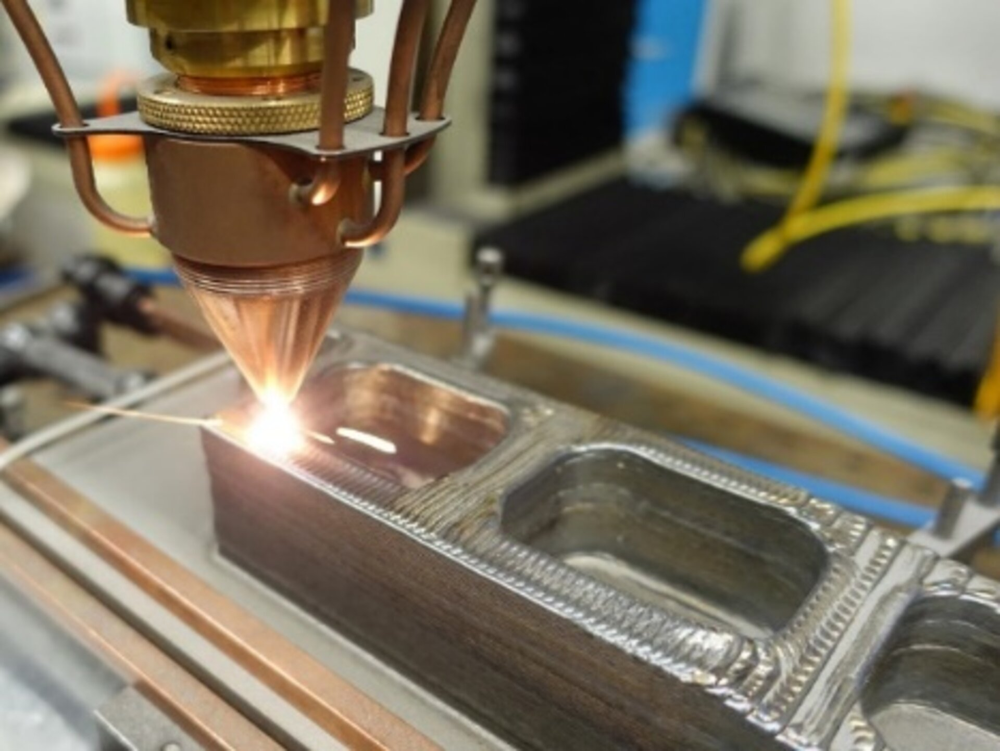
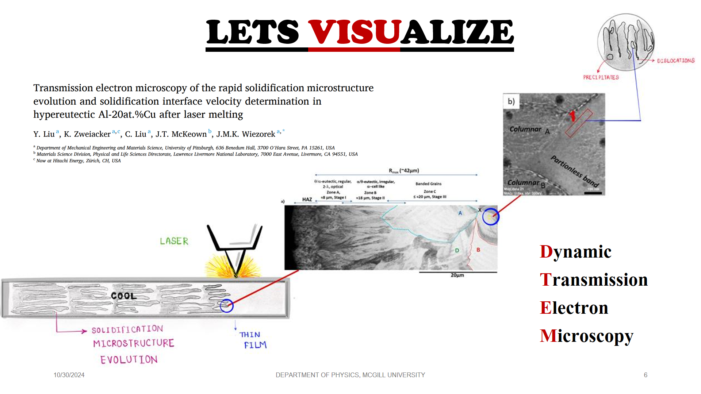

## AIM

“Rapid Solidification of two component alloy (AlCu) using the Phase Field Crystal model to investigate the formation of dislocations and the subsequent precipitate formation in the rapid 3D Laser printing in additive manufacturing.”

| {:style="height:200px;width:200px;"} | {:style="height:200px;width:200px;"}
|---|---|

The aim of my research project is to study rapid solidification of a two-component Al-Cu
alloy solidification using compuational simulations using a recently published OpenPFC al
gorithm for efficient 3D simulations of the phase field crystal model (PFC). Phase field crystal
(PFC) is a hybrid atomic-continuum technique that captures atomic resolution information of
crystalline matter while operating on diffusive time scales. The new OpenPFC modeling
platform will be used to go beyond what has been done in previous work for the study of
rapid solidification in pure (single species) materials. I will investigate the production of dis
locations at a fluctuating interfaces and inter-phase boundaries during rapid solidification of
an Al-Cu alloy, and concurrent or subsequent precipitation of a solid-state phase at or near
the cores of dislocations and other defects.

{:style="height:400px;width:800px;"}