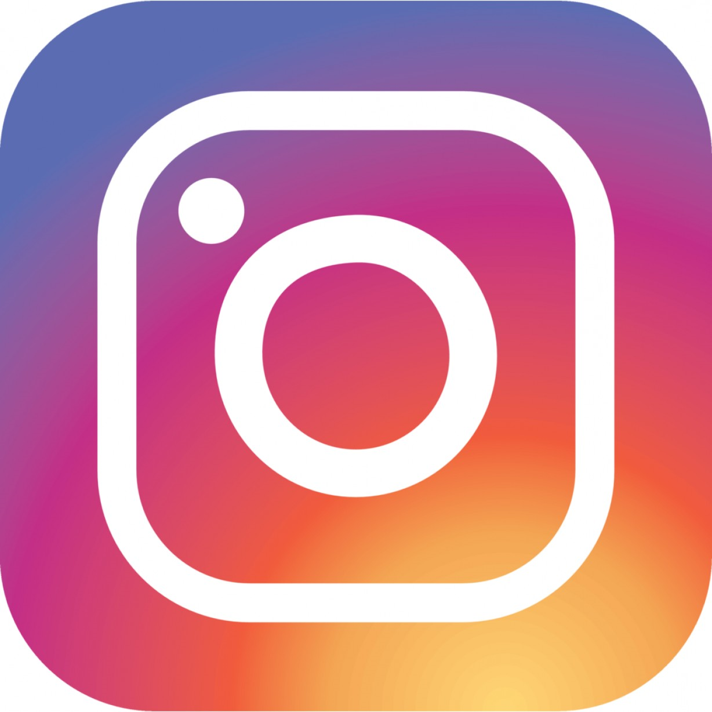
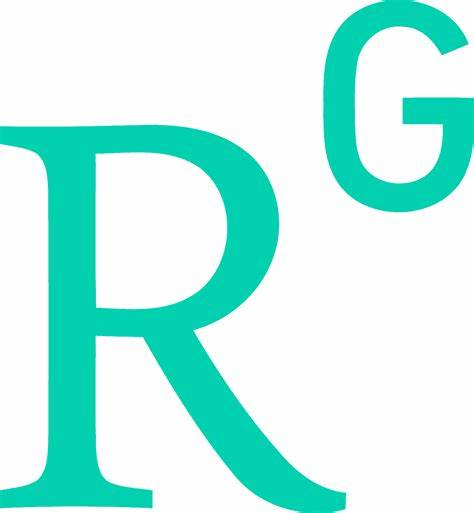

## About Me
{align="center" style="height:300px;width:300px"}

{style="height:20px; width:20px"} [Connect on LinkedIn](https://www.linkedin.com/in/your-linkedin-username/)  
{style="height:20px; width:20px"} [Instagram](https://www.instagram.com/in/your-instagram-username/)  
{style="height:20px; width:20px"} [Gmail](https://www.gmail.com/in/your-gmail-username/)  
{style="height:20px; width:20px"} [GitHub](https://www.github.com/in/your-github-username/)  
{style="height:20px; width:20px"} [ResearchGate](https://www.researchgate.com/in/your-researchgate-username/)  
{style="height:20px; width:20px"} [Google Scholar](https://www.googlescholar.com/in/your-googlescholar-username/)  
{style="height:20px; width:20px"} [xxxxx-xxxxx]  

My name is Ravneet Kaur. I am a graduate student pursuing a Master of Science in Physics at McGill University, Montreal. I have completed my undergraduate Physics Honours from the University of Delhi, India. As a theoretical physicist specializing in Condensed Matter Physics, I work as a Research Assistant in Dr. Nikolas Provatas's research group. 

I am passionate about learning and constantly eager to explore new things. I am currently working on my research project focused on the Structural Phase Field Crystal (XPFC) Vapor Model for binary alloys. Currently, I am learning how to make the phase diagrams for simple PFC and XPFC models for Pure materials and understanding the mechanism behind the Rapid solidifications. Working theoretically and making numerical simulations of such models has not only allowed me to deep delve into the world of Phase Field Crystal modeling but also helped me understand the real-world context of solids and liquids and their behavior at different conditions which works practically at industries. This practical insight has been invaluable. I am looking forward to work and get some real time results for my Research Project.

Beyond my academic and professional pursuits, I have a creative side that finds expression through photography, capturing the world’s beauty one frame at a time. I love traveling and exploring different places. 

